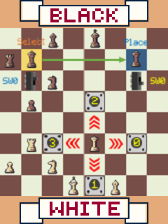
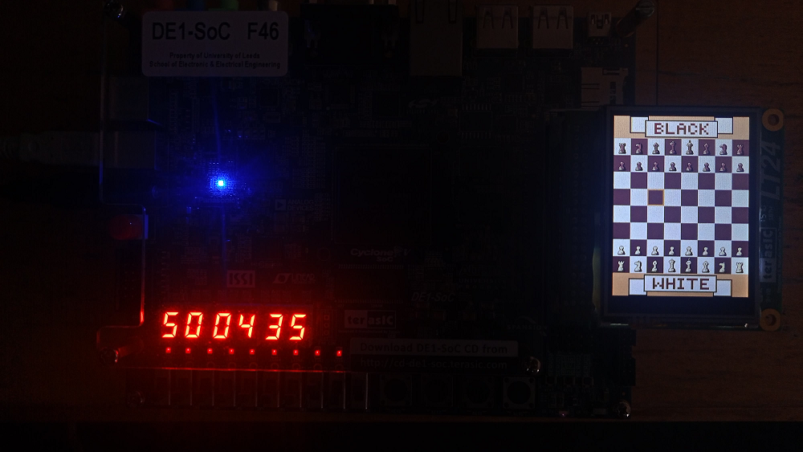
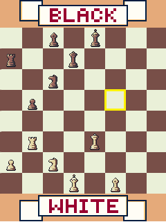
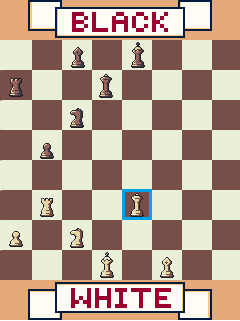
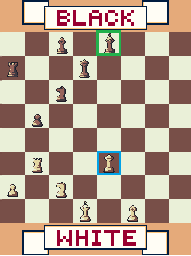
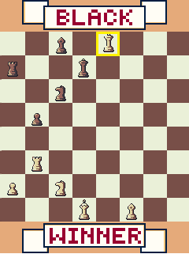

# ELEC5566M Mini-Project - Timed Chess Game

The game is developed for the DE1-SoC board and utilizes the LT24 QVGA display for graphical output. Players can interact with the game using keys for movement and switches for piece selection and game control functions. Additionally, a countdown timer displayed on seven-segment displays adds the option for timed gameplay, enabling different game modes such as blitz chess.

The following files are provided
| File | Purpose |
| ---  | --- |
| `Chess.v`         | Main Module for Chess Game |
| `ChessEngine.v`     | Submodule which comprises all the main logic of the game |
| `ChessLayoutMatrix.v` | Submodule which comprises the logic to decide the layout of chess board |
| `SevenSegmentDisplay.v`       | Submodule to display numbers on seven segment displays |
| `CountdownTimer.v`       | Submodule for countdown timers to play timed chess game |
| `ClockFrequencyDivider.v`       | Submodule to have clock with different frequency |
| `UpCounterNbit.v`       | Submodule to count upwards |
| `LT24Display.v`       | Submodule to handle LT24 interface |
| `MemInitFiles/*`| Folder with all the hex files of images and layout used to initialise game memory |
| `RTLDiagrams/*`| RTL diagrams of the chess game|
|`Images/*` | Gameplay images|
| `set_Chess_IO_pins_locs.tcl`       | TCL script containing pin mappings for the peripherals |
| `simulation/CountdownTimer_tb.v*`             | Testbench for the countdown timer submodule | 

## `Structure` folder

This folder contains verilog gate level RTL viewer diagrams of the Chess.  

## `MemInitFiles` folder

This folder contains verilog gate level RTL viewer diagrams of the Chess.  

## `Images` folder

This folder contains chess gameplay images.  

## `LT24Display.v`

This is the file taken from [github resources](https://github.com/leeds-embedded-systems/ELEC5566M-Unit3-SoulSantosh/blob/main/3-2-LT24TestProject/LT24Display.v).

## `UpCounterNbit.v`

The code for this submodule is taken from [github resources](https://github.com/leeds-embedded-systems/ELEC5566M-Unit3-SoulSantosh/blob/main/3-2-LT24TestProject/LT24Top.v).  
 
 Added functionality in the counter to starting counting from an offset value given as a parameter.  

## `Chess.v` file

1. **Module Overview**: `chess.v` is the top-level Verilog module for the chess game implementation.

2. **Inputs and Outputs**: It defines inputs for game controls like switches and buttons, as well as outputs for controlling the LCD display and displaying player timers.

3. **Submodule Instantiation**: Instantiates the `ChessEngine` submodule, which contains the core logic of the chess game.

4. **Signal Connections**: Connects the inputs and outputs of the module to corresponding signals in the `ChessEngine` submodule.

5. **Game Logic and Control**: Implements behavioral logic for controlling game flow, updating the display, and interfacing with input switches to provide an interactive gaming experience.

## `ChessEngine.v` file

1. **Module Overview:** `ChessEngine.v` encapsulates the core logic and functionality of the chess game.

2. **Inputs and Outputs:** Defines inputs for clock and reset signals, as well as various control signals for game state and player actions. Outputs include signals for updating the LCD display and player timers.

3. **Submodule Instantiation:** Instantiates of `ChessLayoutMatrix` and `CountdownTimer` submodules responsible for chess board layout management and timer control.

4. **Game Logic Implementation:** Implements the rules and mechanics of chess, including piece movement, capture, check, checkmate detection, and game state management. Displays graphics according to chess layout and the different game states.

5. **State Machine Design:** Utilizes state-based design to manage the flow of the game, transitioning between states such as player turns, piece selection, and game over conditions.

## `ChessLayoutMatrix.v` file

1. **Module Overview:** `ChessLayoutMatrix.v` governs the arrangement and attributes of pieces on the chessboard, enabling efficient representation and manipulation of game state.

2. **Inputs and Outputs:** Receives user input signals for controlling piece movement, locking, and navigation within the game interface. Outputs include signals indicating the layout, current player and checkmate status.

3. **Matrix Representation:** Utilizes a matrix data structure to represent the layout of the chessboard, with each element corresponding to a specific square and storing information about the occupying piece.

4. **Piece Movement Validation:** Implements logic to validate player moves based on the rules of chess, including checks for legal moves, capturing opponent pieces, and enforcing special move conditions.

5. **Game State Management:** Manages the overall game state, including tracking the current player's turn, detecting checkmate conditions, and facilitating transitions between different phases of the game.

## `SevenSegmentDisplay.v` file

1. **Module Overview:** The `SevenSegmentDisplay.v` module controls the display of numerical digits on a seven-segment display, facilitating the visual representation of game timers and other numeric data.

2. **Inputs and Outputs:** Accepts input signals representing numerical values to be displayed. Outputs control the illumination of individual segments to render the corresponding digits.

3. **Digit Segmentation:** Divides the display into segments corresponding to each digit, utilizing separate control signals for each segment to enable selective illumination and representation of numeric characters.

4. **Modularity and Reusability:** Designed with modularity in mind, allowing for easy integration into various digital display applications beyond chess, promoting code reusability and scalability.

## `CountdownTimer.v` file

1. **Module Overview:** The `CountdownTimer.v` module facilitates the implementation of countdown timers used in the chess game to track each player's remaining time.

2. **Timer Control:** Accepts control signals to start, pause, reset, and stop the countdown timer based on game state transitions and user actions.

3. **Time Display:** Utilizes the `SevenSegmentDisplay` module to visually represent the remaining time in minutes and seconds on the chessboard, enabling players to monitor their time status during gameplay.

4. **Timeout Detection:** Monitors the countdown timer and triggers a timeout flag when the timer reaches zero, indicating that the respective player has run out of time and potentially resulting in a game-ending condition such as checkmate.

5. **Integration with Game Logic:** Seamlessly integrates with the `ChessEngine` module to synchronize timer operation with game state transitions, ensuring accurate timekeeping and timely updates to the game interface.

## `ClockFrequencyDivider.v` file

1. **Module Overview:** The `ClockFrequencyDivider.v` module is responsible for dividing the clock frequency to generate slower clock signals used in various components of the chess game, such as timers.

2. **Frequency Division Control:** Accepts control signals to dynamically adjust the division ratio, allowing the flexibility to generate clock signals at different frequencies based on specific timing requirements.

3. **Integration with Game Components:** Seamlessly integrates with other modules such as timers, display controllers, and game logic components, serving as a fundamental building block for coordinating time-sensitive operations within the chess game.

## Gameplay

when the game is started the LCD will display this screen.

Upon swithing on SW[0] which is assigned as PlaySwitch, the game will show chess layout. If the timer is enabled using TimerSwitch SW[2] the timer for the white player will immediately start the countdown.

The square with the yellow border is the square currently selected. This square can be moved up/down/right/left using the four keys on DE1-SoC. The movement associated with each key press is shown in the game's start screen.

The player can move the selection towards their chess piece. Once thier chess piece is selected they need to use LockSwitch SW[1] to lock that particular chess piece. This will tell the game that this piece is selected for re-positioning. The yellow border will turn to blue once the piece is locked successfully. If chess piece of opponent is selected the piece won't get locked.

Now the target square can be selected by pressing the four keys. The target square where the chess piece needs to be positioned will he highlighted by a green border.

Once the LockSwitch is switched off it will immediately update the selected chess piece position. If the target square violates the rules of chess and the movement of that particular chess piece, the position won't get updated. 

As the white team captured the black team's King, the white team is the winner. The game ends with a 'WINNER' text displayed on their banner. The game will also end if the countdown timer reaches 0. The player who didn't timeout will be declared as winner.

